# UNGRD — Gestión de Temas Operativos

Plataforma web institucional para **captura** y **analítica** de temas misionales de la [Unidad Nacional para la Gestión del Riesgo de Desastres (UNGRD)](https://portal.gestiondelriesgo.gov.co/), enmarcada en el **Sistema Nacional de Gestión del Riesgo de Desastres (SNGRD)**.

| | |
|---|---|
| **Versión** | `0.1.0` · prototipo funcional |
| **Repositorio** | [PhDRedondo/ungrd-temas-operativos](https://github.com/PhDRedondo/ungrd-temas-operativos) |
| **Demo** | [ungrd-manejo-phi.vercel.app](https://ungrd-manejo-phi.vercel.app) |
| **Referencia UX** | [Inventario de Pozos / ANH GOP](https://inventario-de-pozos.vercel.app) |
| **Identidad** | Branding SNGRD/UNGRD (navy + amarillo; logos color / 1 tinta) |

---

## Tabla de contenidos

1. [Resumen ejecutivo](#1-resumen-ejecutivo)
2. [Arquitectura del prototipo actual](#2-arquitectura-del-prototipo-actual)
3. [Mapa de rutas y experiencia de usuario](#3-mapa-de-rutas-y-experiencia-de-usuario)
4. [Módulo de captura](#4-módulo-de-captura)
5. [Módulo de analítica (filtros cruzados)](#5-módulo-de-analítica-filtros-cruzados)
6. [Temas operativos (carpetas autónomas)](#6-temas-operativos-carpetas-autónomas)
7. [Stack tecnológico](#7-stack-tecnológico)
8. [Estructura del repositorio y flujo GitHub](#8-estructura-del-repositorio-y-flujo-github)
9. [Arquitectura objetivo en Alibaba Cloud](#9-arquitectura-objetivo-en-alibaba-cloud)
10. [Modelo de datos propuesto](#10-modelo-de-datos-propuesto)
11. [Seguridad y operación](#11-seguridad-y-operación)
12. [Roadmap](#12-roadmap)
13. [Desarrollo local](#13-desarrollo-local)
14. [Despliegue](#14-despliegue)
15. [Limitaciones del prototipo](#15-limitaciones-del-prototipo)

---

## 1. Resumen ejecutivo

La aplicación centraliza **20 módulos** (19 temas operativos + plantilla de referencia: agua y saneamiento, carrotanques, obras de emergencia, presupuesto, declaratorias, etc.). Cada tema ofrece:

- **Captura de datos**: formulario individual + carga masiva Excel.
- **Analítica**: KPI, mapa departamental/municipal, torta, barras, serie temporal, Sankey y heatmap, con **filtros cruzados** entre visualizaciones.

**Organización para equipos:** el monorepo aísla cada tema en `src/themes/<slug>/`, de modo que cada desarrollador puede evolucionar su módulo desde GitHub con PRs acotados, sin pisar el trabajo de otros. El núcleo compartido (`src/components`, `src/lib`, `src/themes/shared`) solo se toca en PRs de arquitectura.

El prototipo actual es **100 % cliente** (Next.js App Router): autenticación demo, datos sintéticos y agregaciones en el navegador. La ficha técnica en `/app/acerca` y las secciones 9–12 definen la articulación con **Alibaba Cloud**.

---

## 2. Arquitectura del prototipo actual

### 2.1 Vista lógica

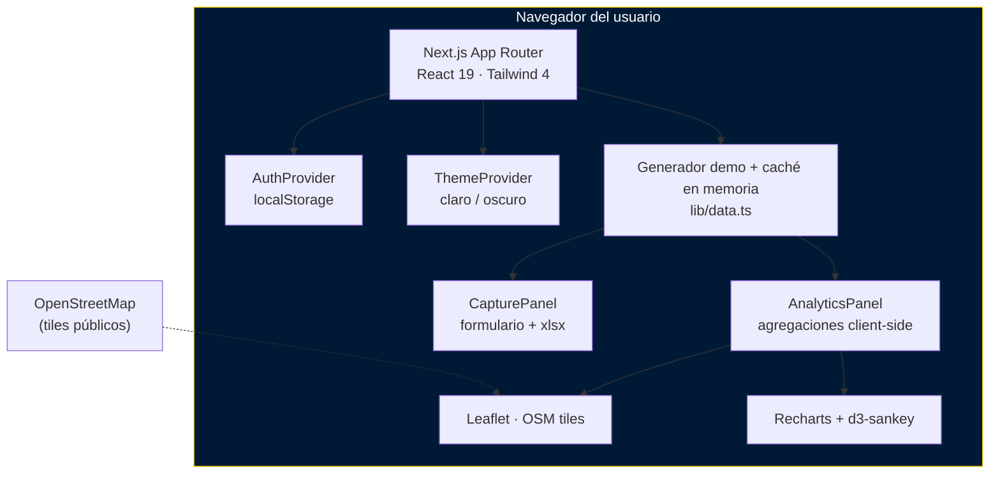

### 2.2 Capas de la aplicación

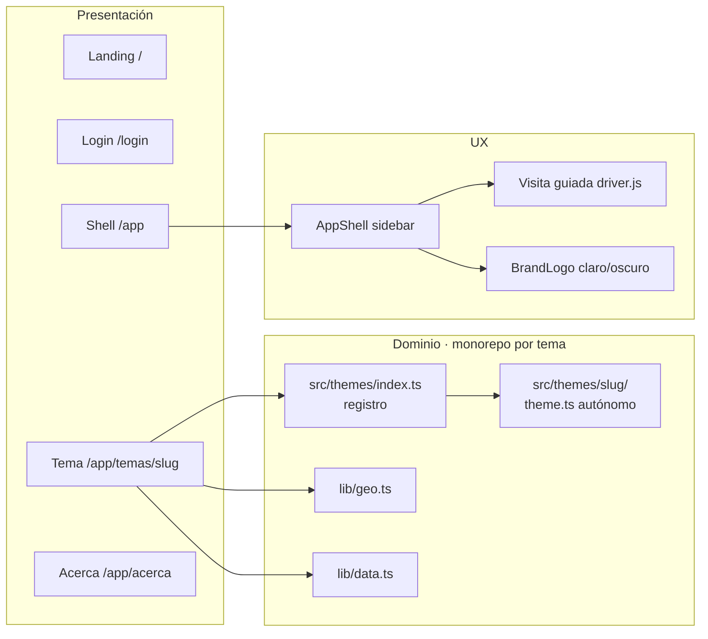

### 2.3 Lo que **no** incluye el prototipo

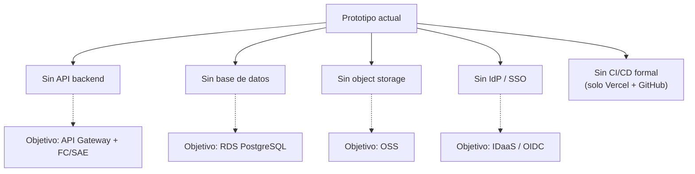

---

## 3. Mapa de rutas y experiencia de usuario

### 3.1 Flujo de navegación

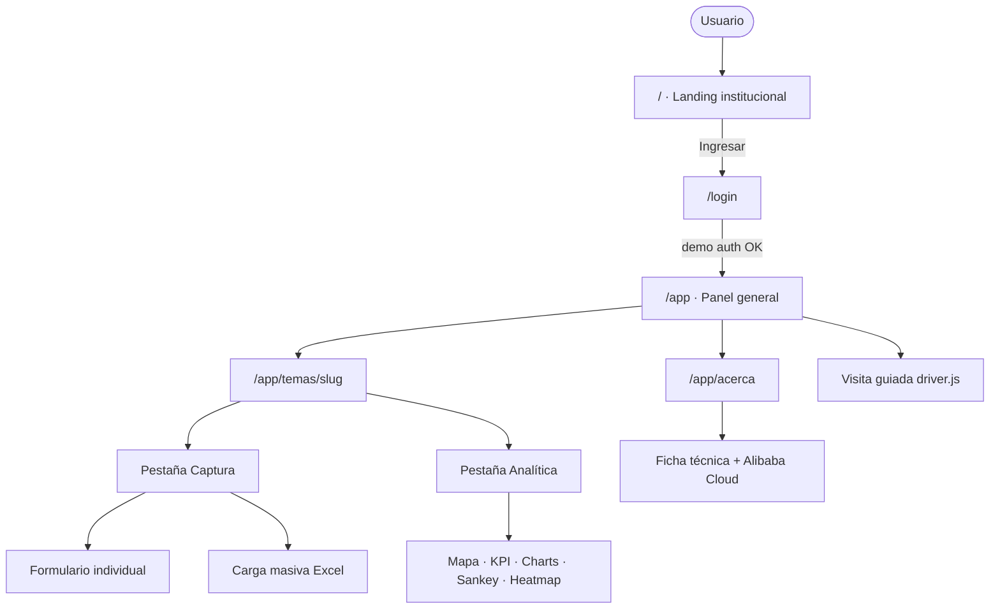

### 3.2 Shell de aplicación

| Elemento | Comportamiento |
|---|---|
| **Sidebar** | Lista de temas (19 operativos + plantilla) + visita guiada + acerca de + panel + logout |
| **Plegar** | Rail de íconos (`w-16`) con tooltips; pestaña a media altura |
| **Tema** | Claro / oscuro (persistido); logo color vs `1 tinta` |
| **Auth** | Guarda usuario en `localStorage` (`ungrd-auth-user`) |

---

## 4. Módulo de captura

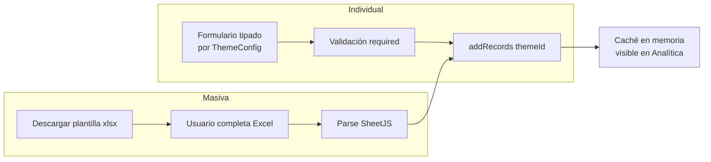

Campos comunes por tema: `departamento`, `municipio`, `fecha`, `estado`, más campos específicos (`valor`, `tipo_intervencion`, etc.).

---

## 5. Módulo de analítica (filtros cruzados)

Todas las visualizaciones comparten el mismo estado de filtros. Un clic en cualquier vista actualiza KPI, mapa, charts, Sankey y heatmap.

### 5.1 Dimensiones de filtro

| Dimensión | Origen típico del clic |
|---|---|
| `departamento` | Mapa (nivel depto), barras, Sankey col. 1, heatmap fila |
| `municipio` | Mapa (con depto activo) |
| `estado` | Select, torta (si no hay categoría), Sankey col. 2 |
| `tercero` / categoría | Torta / Sankey col. 3 (campo select del tema) |
| `periodo` `YYYY-MM` | Serie temporal, heatmap celda/columna |
| `from` / `to` | Inputs de fecha del panel |

### 5.2 Flujo de filtros cruzados

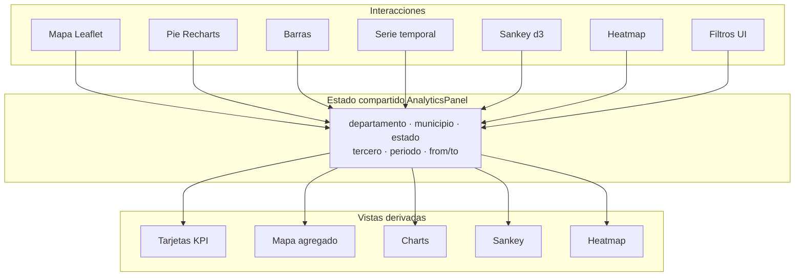

### 5.3 Pipeline Sankey

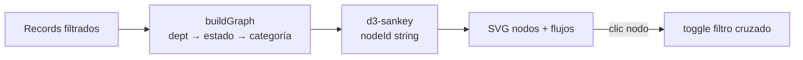

---

## 6. Temas operativos (carpetas autónomas)

Cada tema es un **módulo de carpeta** con su propio `theme.ts`, registrado en `src/themes/index.ts`. La ruta pública sigue siendo `/app/temas/{slug}`.

### 6.1 Catálogo

| # | Tema | Slug / carpeta | Ruta app |
|---|---|---|---|
| 1 | Agua y Saneamiento | `agua-y-saneamiento` | `/app/temas/agua-y-saneamiento` |
| 2 | Carrotanques | `carrotanques` | `/app/temas/carrotanques` |
| 3 | Obras de Emergencia | `obras-de-emergencia` | `/app/temas/obras-de-emergencia` |
| 4 | Puentes | `puentes` | `/app/temas/puentes` |
| 5 | Banco de Maquinaria | `banco-de-maquinaria` | `/app/temas/banco-de-maquinaria` |
| 6 | Obras por impuestos | `obras-por-impuestos` | `/app/temas/obras-por-impuestos` |
| 7 | Asistencia Humanitaria | `asistencia-humanitaria` | `/app/temas/asistencia-humanitaria` |
| 8 | Gestión de Servicios | `gestion-de-servicios` | `/app/temas/gestion-de-servicios` |
| 9 | Subsidios de Arriendos | `subsidios-de-arriendos` | `/app/temas/subsidios-de-arriendos` |
| 10 | Alertas tempranas | `alertas-tempranas` | `/app/temas/alertas-tempranas` |
| 11 | Asistencia técnica | `asistencia-tecnica` | `/app/temas/asistencia-tecnica` |
| 12 | Equipo de respuesta | `equipo-de-respuesta` | `/app/temas/equipo-de-respuesta` |
| 13 | Compra de materiales | `compra-de-materiales` | `/app/temas/compra-de-materiales` |
| 14 | FIC | `fic` | `/app/temas/fic` |
| 15 | Convenios | `convenios` | `/app/temas/convenios` |
| 16 | Presupuesto | `presupuesto` | `/app/temas/presupuesto` |
| 17 | Ejecución financiera | `ejecucion-financiera` | `/app/temas/ejecucion-financiera` |
| 18 | Materiales | `materiales` | `/app/temas/materiales` |
| 19 | Declaratoria de emergencia | `declaratoria-de-emergencia` | `/app/temas/declaratoria-de-emergencia` |
| 20 | **Plantilla** (línea base, no modificar) | `plantilla` | `/app/temas/plantilla` |

Ruta en disco: `src/themes/<slug>/`. La carpeta `plantilla` es la referencia congelada para copiar o comparar temas.

### 6.2 Contenido de cada carpeta de tema

```text
src/themes/<slug>/
├── theme.ts      # buildTheme({ id, name, extraFields, … })
├── index.ts      # export del ThemeModule
└── README.md     # guía del desarrollador dueño del tema
```

Contrato exportado (`ThemeModule`):

```ts
{ config: ThemeConfig }
```

`ThemeConfig` incluye `id`, textos, `icon`, `unit`, `valueLabel` y `fields` (geo + campos propios + fecha/estado).

### 6.3 Diagrama de registro

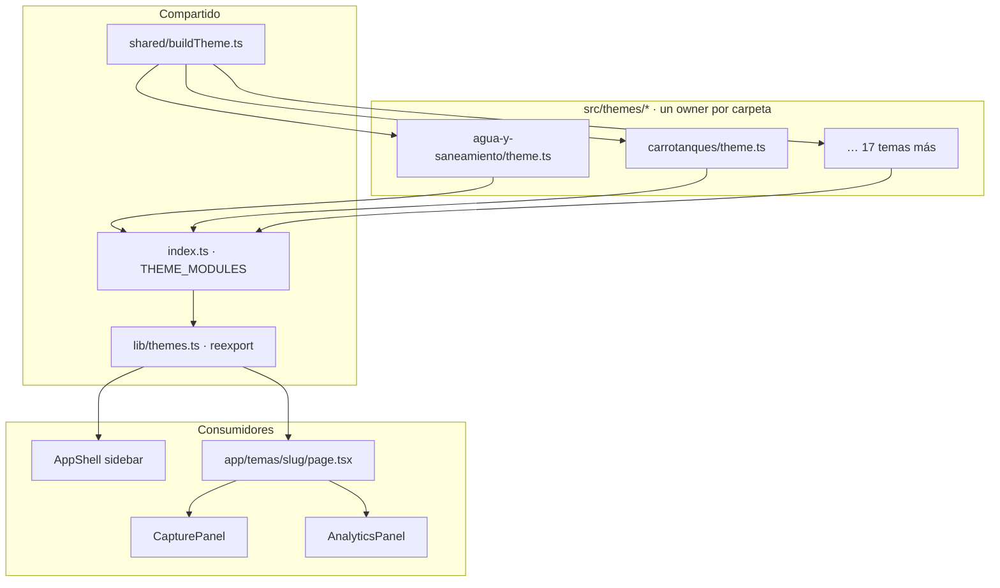

---

## 7. Stack tecnológico

| Capa | Tecnología | Uso |
|---|---|---|
| Framework | **Next.js 16.2** (App Router, Turbopack) | SSR/SSG, rutas, deploy |
| UI | **React 19** · **Tailwind CSS 4** · Nunito Sans · Lucide | Interfaces |
| Mapas | **Leaflet 1.9** · **react-leaflet 5** · OSM | Coropleta por centroides |
| Charts | **Recharts 3** | Torta, barras, serie |
| Sankey | **d3-sankey** · **d3-shape** | Flujo dept → estado → categoría |
| Excel | **SheetJS (xlsx)** | Plantillas y carga masiva |
| Tour | **driver.js** | Visita guiada |
| Utils | **clsx** | Clases condicionales |
| Lenguaje | **TypeScript 5** | Tipado estricto |

### Diagrama de dependencias de frontend

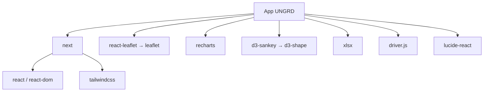

---

## 8. Estructura del repositorio y flujo GitHub

```text
ungrd-app/
├── .github/CODEOWNERS        # Dueños por carpeta de tema
├── CONTRIBUTING.md           # Cómo trabajar un tema de forma autónoma
├── public/branding/          # Logos color y 1 tinta
├── src/
│   ├── app/                  # Rutas Next.js (landing, login, shell, temas)
│   ├── components/           # Núcleo compartido (Shell, Captura, Analítica)
│   ├── lib/                  # Auth, data, geo; lib/themes.ts reexporta el registro
│   └── themes/               # ★ Un directorio por tema (autonomía GitHub)
│       ├── README.md
│       ├── index.ts          # Registro THEME_MODULES
│       ├── shared/           # types + buildTheme
│       ├── agua-y-saneamiento/
│       │   ├── theme.ts
│       │   ├── index.ts
│       │   └── README.md
│       ├── carrotanques/
│       └── … (19 temas + plantilla)
├── package.json
└── README.md
```

### 8.1 Por qué carpetas (no un solo `themes.ts`)

| Beneficio | Detalle |
|---|---|
| PRs pequeños | Un PR típicamente solo cambia `src/themes/<slug>/` |
| Menos conflictos Git | Devs A y B no editan el mismo archivo monolítico |
| CODEOWNERS | GitHub puede exigir review del dueño de la carpeta |
| Onboarding | Cada tema trae su `README.md` local |
| Extensión futura | Validaciones, demo data o UI propia viven junto al tema |

### 8.2 Flujo de trabajo autónomo

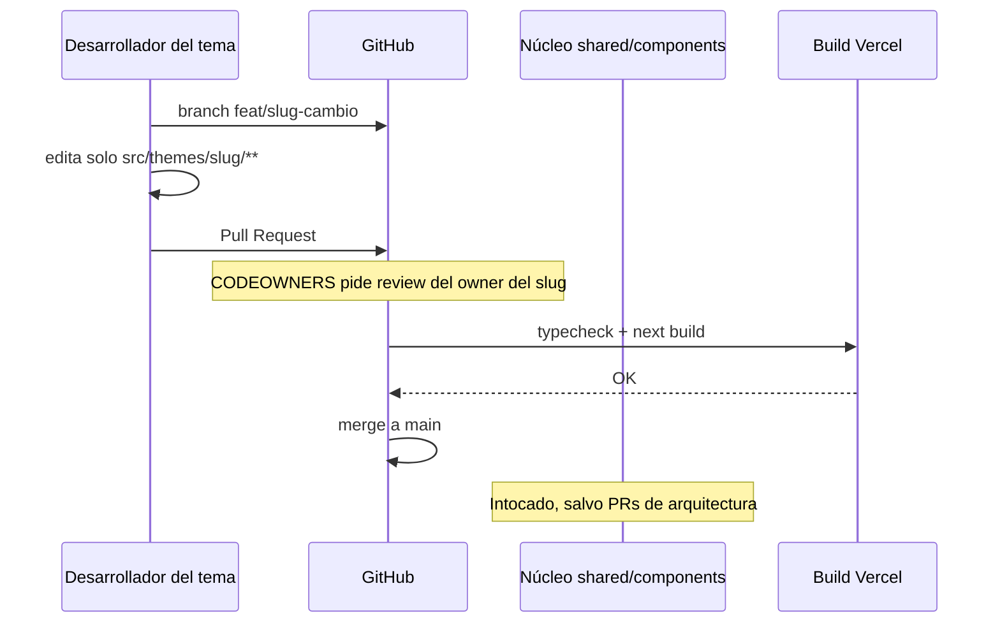

```bash
# Ejemplo: trabajar Agua y Saneamiento
git checkout -b feat/agua-y-saneamiento-nuevo-campo
# Editar únicamente:
#   src/themes/agua-y-saneamiento/theme.ts
#   src/themes/agua-y-saneamiento/README.md  (opcional)
git add src/themes/agua-y-saneamiento
git commit -m "feat(agua-y-saneamiento): agregar campo X"
git push -u origin HEAD
# Abrir PR en GitHub
```

### 8.3 Crear un tema nuevo

1. Copiar `src/themes/agua-y-saneamiento` como plantilla → renombrar carpeta.
2. Ajustar `id`, textos e `extraFields` en `theme.ts`.
3. Importar y registrar el módulo en `src/themes/index.ts`.
4. Añadir la ruta en `.github/CODEOWNERS`.
5. Verificar en `/app/temas/<slug>` y abrir PR (arquitectura + tema).

### 8.4 Qué sí / qué no tocar

| Sí (en su carpeta) | No (sin PR de núcleo) |
|---|---|
| `extraFields`, labels, icono, descripción | `src/components/*` |
| README del tema | Otras carpetas `src/themes/<otro>/` |
| Futuros `demo.ts` / `rules.ts` del tema | Romper el contrato `ThemeConfig` |
| | Quitar el tema del registro sin acuerdo |

Documentación detallada: [`CONTRIBUTING.md`](CONTRIBUTING.md) · [`src/themes/README.md`](src/themes/README.md) · [`.github/CODEOWNERS`](.github/CODEOWNERS).

Reglas de Cursor (el agente respeta la carpeta del tema): [`.cursor/rules/theme-autonomy.mdc`](.cursor/rules/theme-autonomy.mdc) · [`.cursor/rules/theme-module.mdc`](.cursor/rules/theme-module.mdc).

---

## 9. Arquitectura objetivo en Alibaba Cloud

El prototipo se articula hacia una arquitectura institucional sobre Alibaba Cloud.

### 9.1 Arquitectura de referencia (producción)

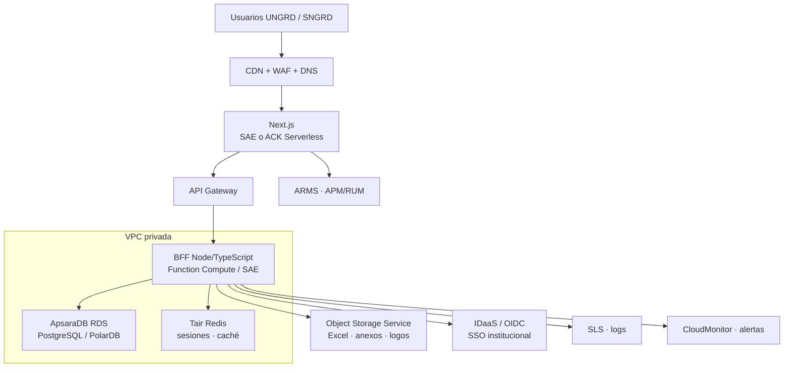

### 9.2 Mapeo capa → servicio

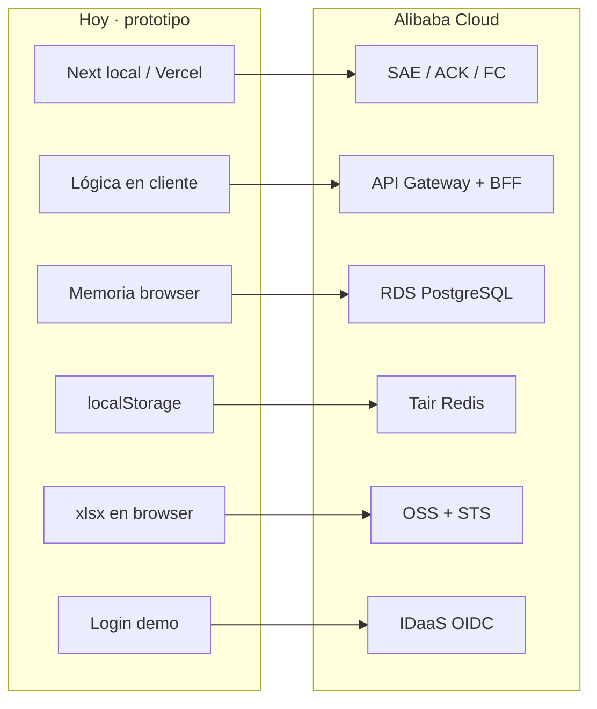

| Capa | Hoy (demo) | Alibaba Cloud |
|---|---|---|
| Frontend / App | Next.js en Vercel / local | **SAE**, **ACK Serverless** o **FC** + CDN |
| API / BFF | No existe | **API Gateway** + FC/SAE |
| Base de datos | Memoria del navegador | **ApsaraDB RDS PostgreSQL** / PolarDB |
| Caché / sesiones | `localStorage` | **Tair (Redis)** |
| Archivos | Parse Excel en cliente | **OSS** + credenciales STS |
| Identidad | Login demo | **IDaaS** / OIDC-SAML institucional |
| Borde | N/A | **CDN** + **WAF** + Anti-DDoS |
| Observabilidad | Consola browser | **SLS** + **ARMS** + CloudMonitor |
| CI/CD | GitHub → Vercel | Yunxiao/Flow o GH Actions → **ACR** → SAE/ACK |
| Analítica pesada | Agregación en cliente | **Hologres** / AnalyticDB / MaxCompute |

### 9.3 Flujo de carga masiva en producción

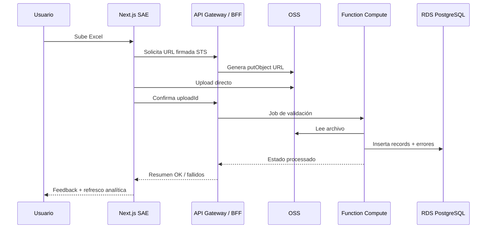

---

## 10. Modelo de datos propuesto

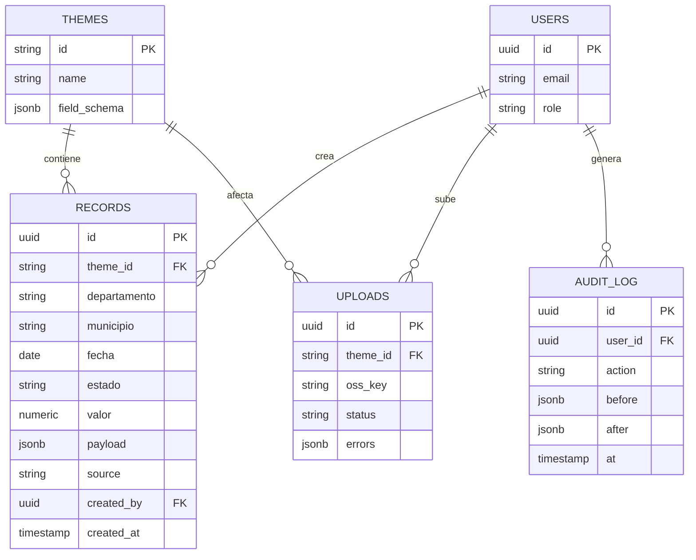

Índices recomendados: `(theme_id, fecha)`, `(theme_id, departamento)`, `(theme_id, estado)`.

---

## 11. Seguridad y operación

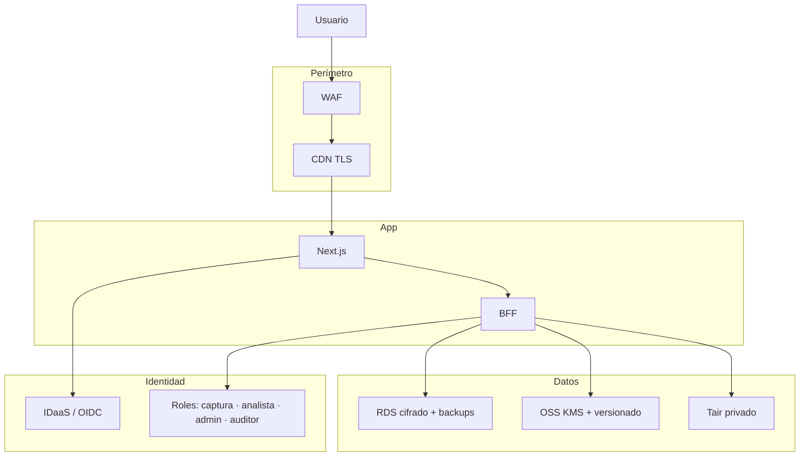

- Tránsito: TLS extremo a extremo.
- Reposo: cifrado RDS/OSS con KMS.
- Red: VPC, Security Groups, endpoints privados a RDS/Tair.
- Auditoría: SLS con retención según política UNGRD.
- Región: validar latencia y **residencia de datos** (Colombia / soberanía).

---

## 12. Roadmap

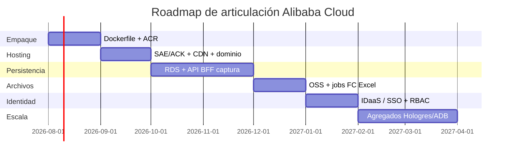

1. **Fase 0 — Empaque:** imagen Docker multi-stage → ACR.  
2. **Fase 1 — Hosting:** SAE/ACK Serverless + CDN + certificado.  
3. **Fase 2 — Persistencia:** RDS + BFF; sacar lógica del cliente.  
4. **Fase 3 — Archivos:** OSS + STS + validación async (FC).  
5. **Fase 4 — Identidad:** OIDC/SSO + roles + auditoría.  
6. **Fase 5 — Escala analítica:** materializados / Hologres.

---

## 13. Desarrollo local

### Requisitos

- Node.js **≥ 20 LTS**
- npm 10+

### Comandos

```bash
git clone https://github.com/PhDRedondo/ungrd-temas-operativos.git
cd ungrd-temas-operativos
npm install
npm run dev
```

Abra [http://localhost:3000](http://localhost:3000).

| Script | Descripción |
|---|---|
| `npm run dev` | Servidor de desarrollo (Turbopack) |
| `npm run build` | Build de producción + typecheck |
| `npm run start` | Sirve el build (`next start`) |
| `npm run lint` | ESLint |

### Login demo

Cualquier correo válido + contraseña de **≥ 4 caracteres**. Ejemplo precargado: `analista@ungrd.gov.co` / `ungrd2026`.

### Trabajar un solo tema en local

```bash
npm run dev
# Abrir http://localhost:3000/app/temas/<slug>
# Editar src/themes/<slug>/theme.ts y recargar
```

Ver sección [8. Estructura del repositorio y flujo GitHub](#8-estructura-del-repositorio-y-flujo-github).

---

## 14. Despliegue

### 14.1 Vercel (demo actual)

Proyecto: `phdredondo-projects/ungrd-manejo`  
Producción: https://ungrd-manejo-phi.vercel.app

```bash
npm run build
vercel --prod
```

GitHub (`main`) puede disparar deploys automáticos si el proyecto está vinculado.

### 14.2 Contenedor (propuesto ACR → SAE/ACK)

```dockerfile
# Esquema orientativo
FROM node:20-alpine AS deps
WORKDIR /app
COPY package*.json ./
RUN npm ci

FROM node:20-alpine AS builder
WORKDIR /app
COPY --from=deps /app/node_modules ./node_modules
COPY . .
RUN npm run build

FROM node:20-alpine AS runner
WORKDIR /app
ENV NODE_ENV=production PORT=3000
COPY --from=builder /app/.next ./.next
COPY --from=builder /app/public ./public
COPY --from=builder /app/package*.json ./
COPY --from=builder /app/node_modules ./node_modules
EXPOSE 3000
CMD ["npm", "run", "start"]
```

Health check sugerido: `GET /` (o `/api/health` cuando exista backend).

### 14.3 Diagrama CI/CD objetivo

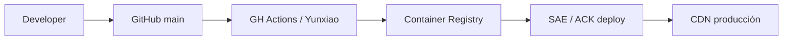

---

## 15. Limitaciones del prototipo

- Sin API backend ni persistencia real (los datos se pierden al recargar, salvo lo añadido en la sesión del navegador).
- Autenticación demo sin tokens, MFA ni roles.
- Excel se procesa enteramente en el cliente.
- Mapa por **centroides** (no GeoJSON oficial DANE/IGAC).
- Observabilidad limitada a lo que Vercel/browser proveen.
- Marca de agua de prototipo: no constituye sistema oficial UNGRD en producción.

---

## Créditos y contacto

- **Producto / arquitectura de referencia:** articulación UNGRD × Alibaba Cloud (ver `/app/acerca`).
- **Autor del repositorio:** [PhDRedondo](https://github.com/PhDRedondo) · `phdredondo@gmail.com`
- **Branding:** logos SNGRD/UNGRD en `public/branding/`.

---

© Prototipo de demostración · SNGRD / UNGRD · No sustituye sistemas oficiales en producción.
