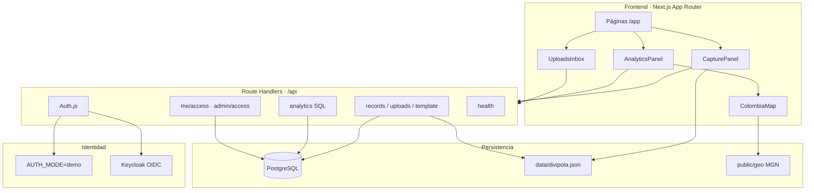

# Arquitectura

## Vista lógica



## Capas en el monorepo

| Capa | Ruta | Responsabilidad |
|------|------|-----------------|
| UI | `src/app/app/**`, `src/components/**` | Experiencia captura / analítica / admin |
| API | `src/app/api/**` | Contrato HTTP, authz, orquestación |
| Dominio | `src/lib/**` | Excel, Zod, geo, ACL, repositorios |
| Persistencia | `src/db/**` | Schema Drizzle, seed |
| Temas | `src/themes/<slug>/` | Schema de negocio por tema (contrato `ThemeConfig`) |
| Geo estático | `data/`, `public/geo/` | DIVIPOLA + polígonos MGN |
| Infra | `docker-compose.yml`, `infra/keycloak/` | Postgres + IdP |

## Front

- React 19 + Tailwind 4 + Recharts + Leaflet.
- Estado de sesión vía Auth.js (cliente) + `useAuth`.
- Analítica: agregación cliente sobre records + verificación SQL (`/analytics`).
- Mapa: fetch de `/geo/departamentos-mgn2024.json` (evita import Turbopack de `.geojson`).

Detalle: [`FRONTEND.md`](./FRONTEND.md)

## Back

- Next.js Route Handlers (no Express separado).
- Drizzle ORM + `postgres` driver.
- Validación: Zod 4 + reglas DIVIPOLA.
- Excel: ExcelJS (plantilla) + parse + cola async para cargas grandes (`after()`).
- Middleware protege `/app` y APIs sensibles.

Detalle: [`BACKEND.md`](./BACKEND.md) · [`API.md`](./API.md)

## Modelo de datos (resumen)

| Tabla | Uso |
|-------|-----|
| `themes` | Catálogo + schema versionado |
| `records` | Columnas fijas + `payload` jsonb + `content_hash` |
| `uploads` | Meta de carga + errores |
| `users` | Identidad demo/Keycloak → rol |
| `user_theme_access` | ACL lectura/escritura por tema |
| `audit_log` | Trazas de acciones |

Fuente de campos: **código** en `theme.ts` del módulo (no solo DB).

## Auth / ACL

```text
Request → middleware sesión
       → requireThemeRead / requireThemeWrite
       → rol + ACL_STRICT + user_theme_access
```

- `admin` / `auditor`: todos los temas.
- Sin filas ACL + `ACL_STRICT=false`: acceso amplio (local).
- Sin filas ACL + `ACL_STRICT=true`: denegar (prod).

## Flujo de datos crítico

```text
Excel / formulario
  → parse + Zod + DIVIPOLA
  → insert records (+ hash anti-dup)
  → upload row + audit
  → UI refresca records
  → mapa/gráficos + /analytics SQL
```

## Decisiones de diseño

Ver [`MEMORY.md`](./MEMORY.md).
