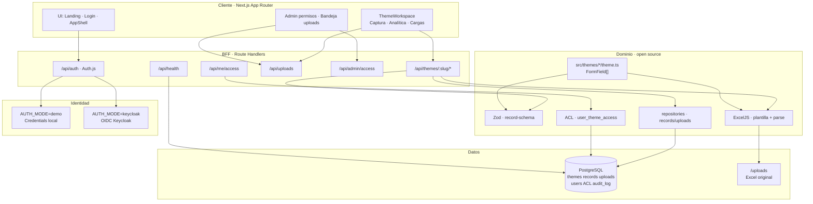
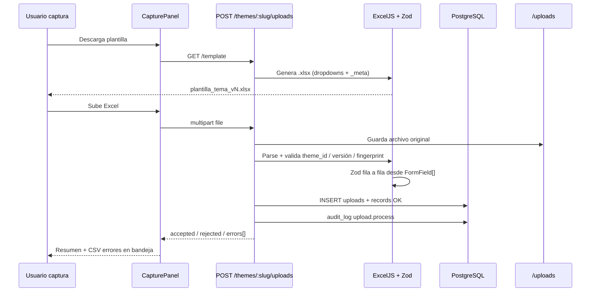
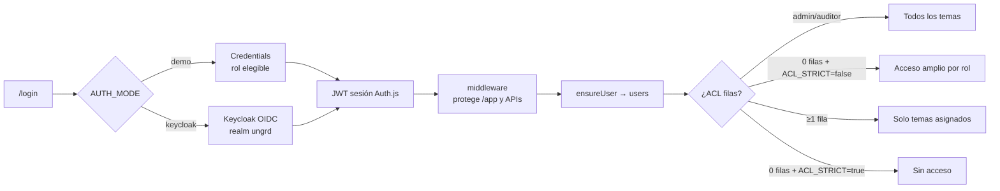
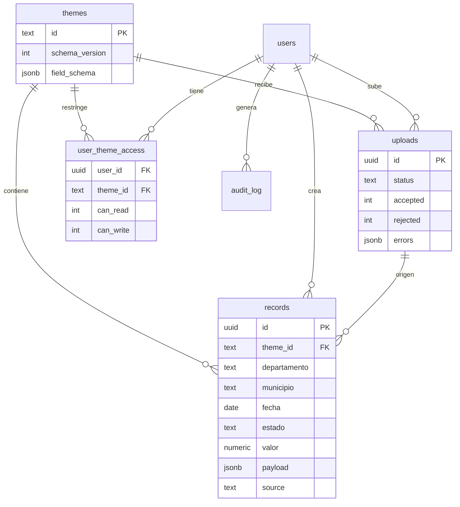
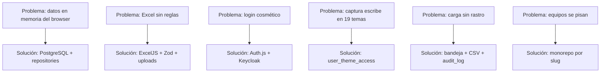

/**
 * UNGRD Temas Operativos — Mapa del sistema completo
 * Artefacto de arquitectura: capas, pipelines, justificación y rutas.
 * Fuente de verdad operativa alineada al código en ungrd-temas-operativos.
 */
# UNGRD — Mapa del sistema completo

> Artefacto de arquitectura para mapear **cómo quedó** la plataforma, **por qué** cada decisión y **cómo fluyen** datos, auth y Excel.  
> Repo: `ungrd-temas-operativos` · Stack 100 % open source · Local-first → Vercel después.

---

## 1. Visión en una frase

Una app Next.js con **19 temas autónomos** (`src/themes/<slug>/`) donde el schema de campos (`FormField[]`) es la **única fuente de verdad** para formulario, plantilla Excel, validación Zod y persistencia en **PostgreSQL**, con identidad **Keycloak/Auth.js** y ACL por tema.

---

## 2. Diagrama de capas (arquitectura)



---

## 3. Pipeline de captura masiva (Excel)



**Por qué así**

| Decisión | Justificación |
|---|---|
| ExcelJS (no solo SheetJS) | Dropdowns, hojas ocultas `_meta`, instrucciones |
| Validación en servidor (Zod) | Excel se puede manipular; la verdad es el schema |
| Filas OK + rechazo parcial | Cargas masivas institucionales no deben fallar enteras |
| Guardar archivo + `uploads` | Auditoría: de dónde salió cada lote |
| Fingerprint / schema_version | Evita plantillas viejas tras cambiar campos |

---

## 4. Pipeline de auth + ACL



**Roles**

| Rol | Lee | Escribe | Admin ACL |
|---|---|---|---|
| `captura` | según ACL | según ACL | no |
| `analista` | según ACL | no | no |
| `admin` | todo | todo | sí `/app/admin/permisos` |
| `auditor` | todo | no | no |

**Por qué Keycloak (no Clerk)**  
Open source, sin licencia SaaS, alineado a IdP institucional futuro; Auth.js es el adaptador OIDC en Next.

**Por qué `ACL_STRICT=false` en local**  
Permite desarrollar sin asignar ACL a cada usuario demo; en Vercel/prod se pone `true`.

---

## 5. Modelo de datos



**Por qué híbrido (columnas fijas + `payload` jsonb)**  
19 temas distintos sin 19 tablas; analítica geo/fecha/estado indexable; campos específicos viven en `payload`.

---

## 6. Mapa de rutas (UI + API)

### UI

| Ruta | Quién | Qué |
|---|---|---|
| `/` | público | Landing |
| `/login` | público | Demo credentials o botón Keycloak |
| `/app` | autenticado | Panel de temas permitidos |
| `/app/temas/[slug]` | ACL read | Captura · Analítica · Cargas |
| `/app/cargas` | autenticado | Bandeja global de Excel |
| `/app/admin/permisos` | admin | ACL por usuario |
| `/app/acerca` | autenticado | Ficha / roadmap |

### API

| Método | Ruta | Guard |
|---|---|---|
| GET | `/api/health` | público |
| * | `/api/auth/*` | Auth.js |
| GET | `/api/me/access` | sesión |
| GET/PUT | `/api/admin/access` | admin |
| GET | `/api/uploads` | sesión + ACL tema |
| GET | `/api/uploads/:id?format=csv` | dueño / admin / auditor |
| GET/POST | `/api/themes/:slug/records` | read / write ACL |
| GET | `/api/themes/:slug/template` | read ACL |
| POST | `/api/themes/:slug/uploads` | write ACL |

---

## 7. Fuente de verdad por tema (sin romper monorepo)

```
src/themes/<slug>/
  theme.ts      ← extraFields + metadata  ★ contrato
  index.ts
  README.md
src/themes/shared/
  types.ts      ← FormField, ThemeConfig, AppRole
  buildTheme.ts ← GEO + extra + fechas/estado
```

Cualquier cambio de campo en `theme.ts` impacta:
1. Formulario UI  
2. Plantilla ExcelJS  
3. Zod server  
4. Snapshot `themes.field_schema` en DB  

**Por qué carpetas autónomas**  
CODEOWNERS / PRs acotados por área misional; el núcleo (`components`, `lib`, `db`) solo en PRs de arquitectura.

---

## 8. Stack y justificación (licencias)

| Capa | Tecnología | Por qué |
|---|---|---|
| App | Next.js 16 | Ya era el prototipo; App Router + API |
| ORM | Drizzle | SQL-first, liviano, Apache-2.0 |
| DB | PostgreSQL | Estándar institucional / RDS futuro |
| Auth | Auth.js + Keycloak | OIDC open source, sin SaaS de pago |
| Excel | ExcelJS + Zod | Plantillas con reglas + validación fuerte |
| UI charts | Recharts / Leaflet | Ya en el prototipo |
| Contenedores | Docker Compose | Postgres app + Keycloak (+ DB KC) |

---

## 9. Variables de entorno (local → Vercel)

| Variable | Local | Vercel después |
|---|---|---|
| `DATABASE_URL` | Postgres brew/Docker | Neon / Supabase / RDS |
| `AUTH_MODE` | `demo` | `keycloak` |
| `NEXT_PUBLIC_AUTH_MODE` | `demo` | `keycloak` |
| `AUTH_SECRET` | dev | secreto fuerte |
| `ACL_STRICT` | `false` | `true` |
| `KEYCLOAK_*` | opcional Compose | IdP institucional |
| `AUTH_URL` | `http://localhost:3000` | URL Vercel |

Detalle operativo: [`docs/BACKEND.md`](./BACKEND.md) · ejemplo: [`.env.example`](../.env.example).

---

## 10. Flujos de valor (qué problema resuelve cada pieza)



---

## 11. Arranque local (checklist)

```bash
# Postgres en :5432 (brew o docker compose)
cp .env.example .env.local
npm install
npm run db:setup    # drizzle push + seed 19 temas
npm run dev         # http://localhost:3000

# Keycloak opcional
docker compose up -d
# luego AUTH_MODE=keycloak en .env.local
```

Health: `GET /api/health` → `{ ok: true, db: "up" }`.

---

## 12. Roadmap

### Hecho
1. Postgres + Drizzle + seed  
2. Keycloak/Auth.js + demo  
3. Excel validado + uploads + bandeja  
4. ACL por tema  
5. **DIVIPOLA oficial** (datos.gov.co · 33 dept / 1122 munis) — no inventado  
6. **GeoJSON oficial departamentos** MGN 2024 DANE FeatureServer/319 — coropleta en mapa  
7. Dedupe por `content_hash`  
8. Cola async uploads (≥500 filas, `after()`)  
9. Agregaciones SQL `/api/themes/:slug/analytics`  

### Siguiente (opcional)
10. GeoJSON municipios (capa 317 MGN2024) bajo demanda / tiles  
11. MinIO / S3 para `/uploads` multi-nodo  
12. `ACL_STRICT=true` + Keycloak en Vercel  
13. Worker dedicado fuera de Next para cargas muy grandes  

---

*Actualizado con DIVIPOLA real y pipeline completo local.*
