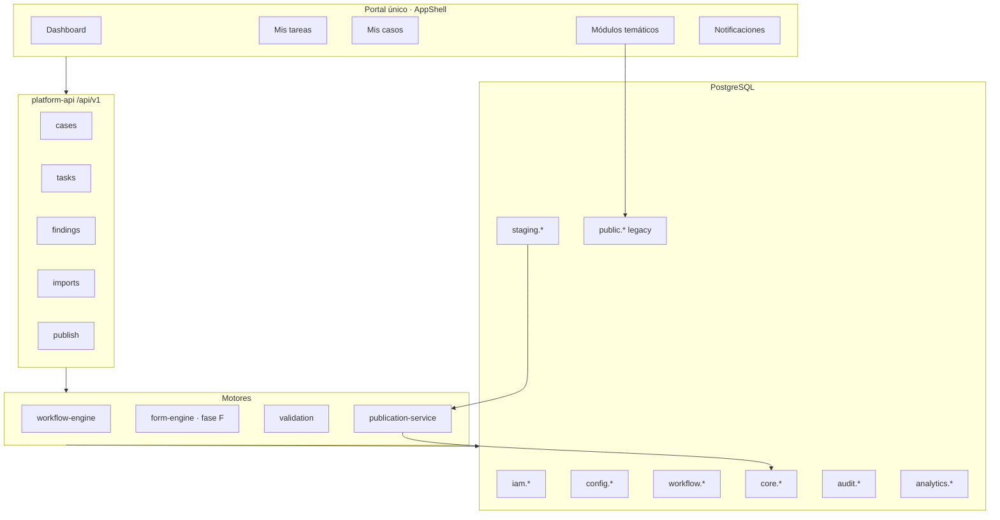

# Arquitectura objetivo

Documento Fase 2 · Plataforma multidependencia integrada sobre el monolito Next.js existente.

## Principio rector

**Monolito modular** con esquemas PostgreSQL separados y APIs versionadas (`/api/v1`), sin fragmentar en 24 microservicios.

```text
portal-frontend (Next.js — existente, extendido)
platform-api      (Route Handlers /api/v1 — nuevo)
workflow-engine   (lib/workflow — nuevo, mismo proceso)
import-worker     (fase E — after() / Cloud Run job)
notification-worker (fase E — outbox consumer)
```

---

## Vista objetivo



Diagrama fuente: [`architecture-diagram.mmd`](./architecture-diagram.mmd).

---

## Conservar / modificar / crear

| Acción | Elemento |
|--------|----------|
| **Conservar** | `src/themes/*`, CapturePanel, Excel, Analytics, Auth.js, security, `/api/themes/*` |
| **Modificar** | AppShell (nav bandeja), middleware (proteger `/api/v1`), drizzle config |
| **Crear** | Esquemas PG, workflow engine, APIs v1, TasksInbox, publication service |
| **Migrar gradual** | `records` → vista operativa; nuevos activos en `core.assets` |
| **Eliminar** | Nada en v1 |
| **No crear** | Microservicio por tema, BPMN externo, segundo portal |

---

## Separación caso / workflow / dato oficial

```text
core.cases              → expediente (id, tipo, dependencia, estado actual)
staging.case_versions   → snapshots inmutables al enviar
workflow.instances      → instancia del proceso
workflow.tasks          → bandeja (quién debe hacer qué)
workflow.review_findings→ devoluciones estructuradas
core.assets             → inventario oficial publicado
public.records          → legacy analítica temática (convive)
```

---

## Autenticación y autorización

```text
Auth (Keycloak) → ¿quién es?
       ↓
iam.users + iam.dependencies
       ↓
RBAC (rol) + ABAC (dependencia, etapa, case_type, action)
       ↓
API handler + optional RLS
```

Permisos nuevos (catálogo en `iam.permissions`):

`case.create`, `case.submit`, `task.approve`, `task.return`, `case.publish`, …

---

## Piloto: carrotanque

| Paso | Dependencia | Acción |
|------|-------------|--------|
| 1 | Logística | Crea caso + borrador |
| 2 | Logística | Envía → versión 1 |
| 3 | Técnica + Jurídica | Revisión **paralela** |
| 4 | Revisor | Devuelve con hallazgos |
| 5 | Logística | Corrige → versión 2 |
| 6 | Técnica + Jurídica | Aprueban |
| 7 | Dirección | Aprueba final |
| 8 | Sistema | Publica → `core.assets`, `core.legal_instruments`, … |

---

## Despliegue serverless (objetivo)

| Componente | Destino |
|------------|---------|
| Next.js app | Cloud Run (contenedor) |
| PostgreSQL | Cloud SQL / RDS |
| Archivos | Object Storage |
| Secretos | Secret Manager |
| Workers | Cloud Run jobs (outbox, import) |

---

## ADR

### ADR-P1 Monolito modular

No separar `platform-api` en otro repo hasta que métricas lo exijan.

### ADR-P2 Motor workflow propio

BPMN externo (Camunda, Temporal) **no** en v1 — configuración en tablas `config.workflow_*`.

### ADR-P3 Publicación atómica

Una transacción PostgreSQL por `publish`; rollback completo si falla.

### ADR-P4 Compatibilidad temas

`/app/temas/[slug]` sigue funcionando; casos nuevos enlazan `module_id = slug`.

---

## Referencias

- [`integration-strategy.md`](./integration-strategy.md)
- [`database-model.md`](./database-model.md)
- [`workflow-engine-design.md`](./workflow-engine-design.md)
