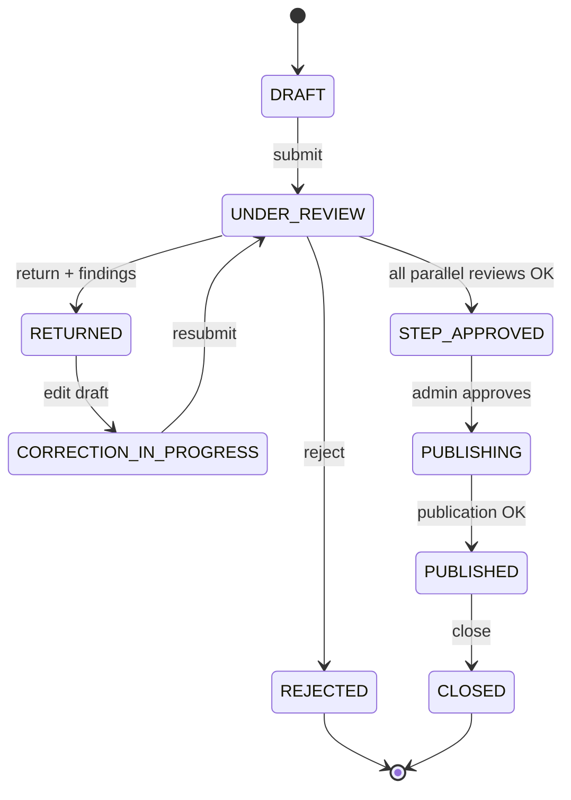

# Máquina de estados — piloto carrotanque

## Reglas paralelas

- Técnica y Jurídica deben completar `approve` antes de crear tarea Dirección.
- Hallazgos `CRITICAL` abiertos bloquean aprobación final.

## Tareas por estado

| Estado caso | Tareas generadas |
|-------------|------------------|
| UNDER_REVIEW | TECH_REVIEW, LEGAL_REVIEW |
| STEP_APPROVED | DIR_APPROVAL |
| RETURNED | (ninguna — corrección en originador) |
